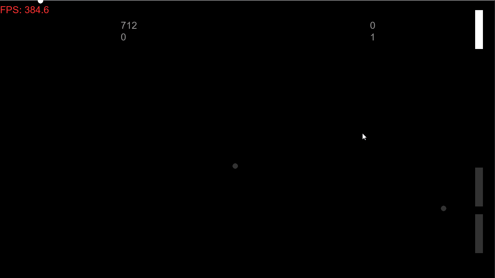
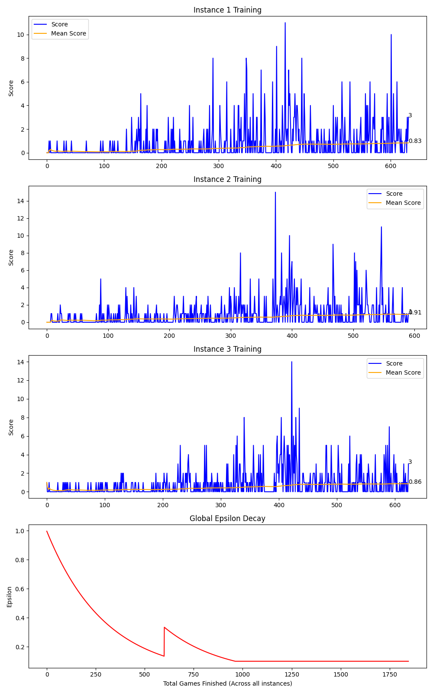

# Deep-Q-Pong 🏓


 
An autonomous AI agent trained to play Pong from scratch using Reinforcement Learning.
 
---
 
## 🎯 Project Overview
 
This project features a custom-built Pong environment and an AI agent powered by a **Deep Q-Network (DQN)**. This environment was developed from the ground up to allow for granular control over physics, state representation, and reward shaping.
 
---
 
## 🚀 Key Features
 
- **Custom Game Engine**  Built with `Pygame`, optimized for high-speed training.
- **Double DQN (DDQN)**  Mitigates overestimation bias by decoupling action selection from evaluation.
- **Optimized Performance**  Fully vectorized Bellman equation implementation using `PyTorch` and `NumPy`.
 
---

## ⚡ Parallel Environments (Vectorized Training)
 
To dramatically accelerate learning and increase data diversity, the environment supports running **multiple game instances simultaneously** within a single window.
 
- **Shared Memory:** All parallel environments feed experiences into a centralized Replay Buffer.
- **Ghost Visualization:** The primary instance is rendered fully, while parallel games are rendered with alpha blending. This creates a "policy cloud" effect, allowing you to monitor all agents without visual clutter or heavy rendering overhead.
 
## 🧠 The AI 
 
The agent perceives the world through a **5-dimensional state vector:**
 
| # | Input |
|---|---|
| 1 | Paddle Y-position |
| 2 | Ball X-position |
| 3 | Ball Y-position |
| 4 | Ball Velocity X |
| 5 | Ball Velocity Y |
  
---
 
## 📊 Visualizing Results
 
The project includes a plotting tool (`Matplotlib`) to monitor:
 
- **Score per Game**  Individual performance
- **Mean Score**  Rolling average to track long-term learning
- **Epsilon Decay**  Visualizing the shift from exploration to exploitation


 
---
 
## 🛠️ Tech Stack
 
| Category | Technology |
|---|---|
| **Language** | Python 3.12 |
| **ML Framework** | PyTorch |
| **Graphics** | Pygame |
| **Analysis** | Matplotlib, NumPy |
| **Deployment** | ONNX, Streamlit (via Neuro-Policy-Mapper) |
 
---
 
## 🏗️ Installation & Usage
 
 
### 1. Install dependencies
 
```bash
pip install -r requirements.txt
```
 
### 2. Run training
 
```bash
python main.py
```

### 🎮 Controls & Hotkeys
 
The application uses a robust State Machine to ensure safe saving without interrupting the PyTorch training loop or causing GIL lock issues.
 
- `P` - **Pause/Resume:** Freezes the environment and training loop.
- `S` - **Save:** (Available only while paused) Saves the PyTorch model (`.pth`), exports the ONNX graph.
- `K` - **Plot:** (Available only while paused) generates plots.
- `W` / `S` - Move left paddle (if set to HUMAN)
- `UP` / `DOWN` - Move right paddle (if set to HUMAN)